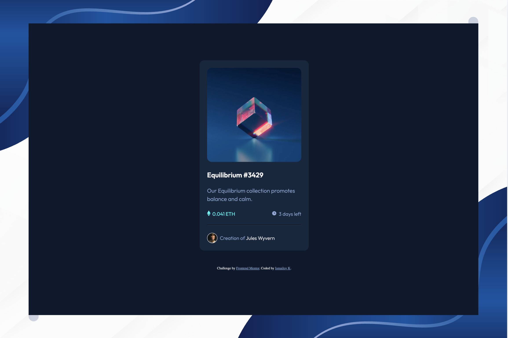

# Frontend Mentor - NFT Preview Card Component Solution

This is a solution to the [NFT preview card component challenge on Frontend Mentor](https://www.frontendmentor.io/challenges/nft-preview-card-component-SbdUL_w0U).

### Screenshot



## Table of contents

- [Overview](#overview)
  - [The challenge](#the-challenge)
  - [Screenshot](#screenshot)
  - [Links](#links)
- [My process](#my-process)
  - [Built with](#built-with)
  - [What I learned](#what-i-learned)
  - [Continued development](#continued-development)
  - [Useful resources](#useful-resources)
- [Author](#author)

---

## Overview

### The challenge

Users should be able to:

- View the optimal layout for the card on desktop, tablet, and mobile screen sizes
- See hover states for interactive elements (NFT image overlay and card title)

### Links

- Solution URL: [Add solution URL here](https://your-solution-url.com)
- Live Site URL: [Add live site URL here](https://your-live-site-url.com)

---

## My process

### Built with

- Semantic HTML5 markup
- CSS custom properties
- Flexbox
- Google Fonts (Outfit)
- CSS hover transitions

### What I learned

#### 1. Semantic HTML
Instead of using plain `<div>` elements, I learned to use semantic tags like `<article>` for the card container. This improves accessibility and makes the code more meaningful.

```html
<article class="main-container">
  <!-- card content -->
</article>
```

#### 2. CSS Reset
Before writing any styles, applying a universal reset ensures consistent rendering across all browsers.

```css
* {
  margin: 0;
  padding: 0;
  box-sizing: border-box;
}
```

#### 3. Centering with Flexbox
To center the card both horizontally and vertically on the page, I used `flexbox` on the `body`. I also learned to use `min-height` instead of `height` so the layout doesn't break when content grows.

```css
body {
  min-height: 100vh;
  display: flex;
  align-items: center;
  justify-content: center;
}
```

#### 4. `position: relative` and `position: absolute`
To create the hover overlay effect on the NFT image, I learned how these two properties work together:
- The parent gets `position: relative` — it becomes the anchor
- The child gets `position: absolute` — it positions itself relative to the parent

```css
.nft-image {
  position: relative;
}

.overlay {
  position: absolute;
  top: 0;
  left: 0;
  width: 100%;
  height: 100%;
}
```

#### 5. Hover Overlay Effect
By combining `opacity: 0` by default and `opacity: 1` on hover, I created a smooth image overlay that reveals an eye icon when the user hovers over the NFT image.

```css
.overlay {
  opacity: 0;
}

.nft-image:hover .overlay {
  opacity: 1;
}
```

#### 6. Google Fonts Integration
I learned how to connect external fonts using `<link>` tags, and why `preconnect` is important — it tells the browser to connect to the font server early for faster loading.

```html
<link rel="preconnect" href="https://fonts.googleapis.com">
<link rel="preconnect" href="https://fonts.gstatic.com" crossorigin>
<link href="https://fonts.googleapis.com/css2?family=Outfit:wght@300;400;600&display=swap" rel="stylesheet">
```

#### 7. `display: flex` is required for `gap` and `align-items`
I discovered that `gap` and `align-items` only work when `display: flex` or `display: grid` is also set on the same element.

```css
.nft-price {
  display: flex;      /* required! */
  align-items: center;
  gap: 6px;
}
```

#### 8. `aria-hidden` for Accessibility
Decorative icons that add no meaning for screen reader users should have `aria-hidden="true"` so assistive technologies skip them.

```html

```

#### 9. SCSS Nesting (Bonus)
I got a brief introduction to SCSS, where related styles can be nested inside their parent selector, making the code cleaner and easier to read. The `&` symbol refers to the parent selector.

```scss
.nft-image {
  position: relative;

  img { width: 100%; }

  &:hover .overlay {
    opacity: 1;
  }
}
```

### Continued development

In future projects, I want to focus on:

- **CSS transitions** — adding smooth animation to hover effects using `transition` property
- **SCSS** — practicing nesting, variables, and mixins in real projects
- **Accessibility** — learning more about ARIA roles and keyboard navigation
- **Responsive design** — using media queries to adapt layouts for different screen sizes

### Useful resources

- [Google Fonts](https://fonts.google.com) - For loading the Outfit font family
- [Frontend Mentor](https://www.frontendmentor.io) - For providing the design and challenge
- [MDN Web Docs - position](https://developer.mozilla.org/en-US/docs/Web/CSS/position) - Helped me understand `relative` and `absolute` positioning

---

## Author

- Frontend Mentor - https://www.frontendmentor.io/profile/Ismail-SWE) #NFT-preview-card-component
